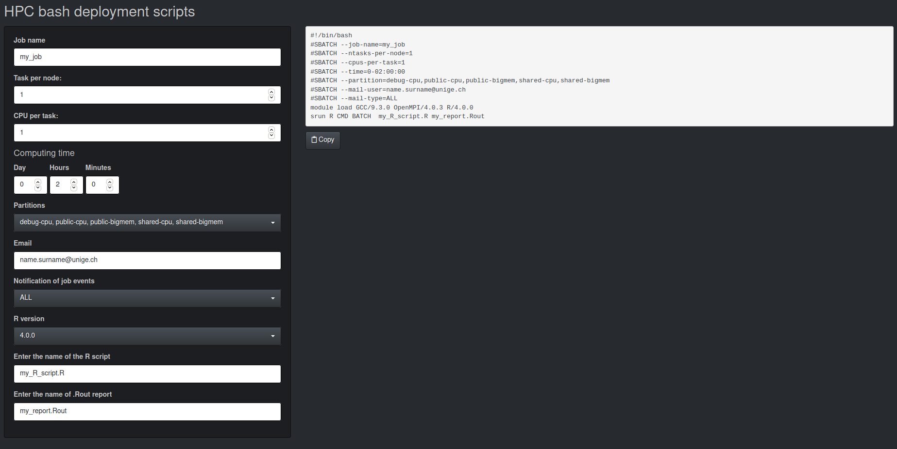

# golembash

Provide a simple GUI to generate `.sh` scripts to launch tasks on Baobab and Yggdrasil HPC cluster ([HPC@UNIGE](https://www.unige.ch/eresearch/en/services/hpc/)) for researchers at the University of Geneva, Switzerland. 



## Installation and use

### Web access
You can access and use the application directly on your browser via [Shinyapp.io](https://www.shinyapps.io/#). Find the app [here](https://data-analytics-lab.shinyapps.io/golembash/).

### Installing the package with GitHub

First install the **devtools** package. Then **swag** with the following
code:

``` r
## if not installed
## install.packages("remotes")

remotes::install_github("SMAC-Group/golembash")

library(golembash) # load the new package
run_app() # run the app
```
